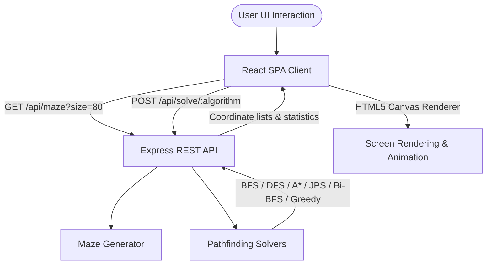

# GridLab — Pathfinding Visualizer & Simulator

GridLab is an interactive, premium web application designed to simulate and visualize pathfinding algorithms on dense 2D grid maps. It provides a visual playground for comparing different graph traversal techniques, understanding their search spaces, and evaluating their execution efficiencies.

---

## 🏗️ System Architecture

GridLab is built as a split two-tier architecture:
- **Frontend Visualizer**: A React + Vite SPA (Single Page Application) written in TypeScript. It utilizes the HTML5 Canvas API for high-performance rendering of dense cell grids, custom CSS/Tailwind for a premium dark/light layout, and Framer Motion for smooth micro-animations.
- **Backend Solver**: An Express REST API built with Node.js and TypeScript. It handles randomized maze generation and runs the graph traversal solvers on CPU threads, returning coordinate path sequences back to the client.



---

## 📁 Directory Structure

```
GridLab/
├── backend/
│   ├── src/
│   │   ├── algorithms/       # Core pathfinding solvers & maze generation
│   │   │   ├── astar.ts       # A* Search Algorithm
│   │   │   ├── bfs.ts         # Breadth-First Search
│   │   │   ├── bidirectional-bfs.ts  # Bidirectional BFS
│   │   │   ├── dfs.ts         # Depth-First Search
│   │   │   ├── greedy.ts      # Greedy Best-First Search
│   │   │   ├── jps.ts         # Jump Point Search (JPS)
│   │   │   ├── maze.ts        # Randomized Maze Generator
│   │   │   └── types.ts       # Shared TypeScript Type definitions
│   │   └── index.ts          # Express Server configuration & REST API routes
│   ├── package.json
│   └── tsconfig.json
├── frontend/
│   ├── public/               # Static assets (Logos, Icons)
│   │   ├── gridlab_logo.png
│   │   └── gridlab_logo_lighttheme.png
│   ├── src/
│   │   ├── canvas/
│   │   │   └── GridCanvas.tsx # Main grid rendering & control dashboard
│   │   ├── components/
│   │   │   ├── LoaderOne.tsx  # Interactive fullscreen loading transition
│   │   │   └── StatsTable.tsx # Visualization metrics table component
│   │   ├── App.tsx           # Layout Shell & Global State Coordinator
│   │   ├── App.css           # Local style overrides
│   │   ├── index.css         # Theme tokens & global CSS structure
│   │   └── main.tsx          # React application entry point
│   ├── package.json
│   └── vite.config.ts
└── README.md                 # Primary Workspace Documentation
```

---

## ⚡ Key Technical Features

### 1. Dual Theme System & Logo Support
- Dynamic style toggling between **Dark Theme** and **Light Theme**.
- The page header automatically switches between `/gridlab_logo.png` (dark background) and `/gridlab_logo_lighttheme.png` (light background) with a fixed height and aspect ratio.
- Custom grid color system adjusted dynamically based on the active theme:
  - **Dark Theme**: Open cells (`#2d2d2d`), Wall cells (`#111111`), Grid lines (`#1a1a1a`).
  - **Light Theme**: Open cells (`#b0b0b0`), Wall cells (`#787878`), Grid lines (`rgba(0,0,0,0.15)`).

### 2. High-Performance Grid Rendering
- Grid size is standard-calibrated at **80×80** ($6,400$ cells).
- Rendered on a single HTML5 `<canvas>` element at a fixed $640\text{px} \times 640\text{px}$ container size.
- Detects the device pixel ratio (`window.devicePixelRatio`) to scale coordinates correctly, avoiding blurry cells on high-DPI (Retina) screens.
- Synchronously updates grid lines and cells during clicks to determine starting (green) and ending (red) points.

### 3. Grid Animating Engine
- Animates algorithm behavior in real-time:
  - **Visited Nodes**: Painted in blue (`#1a7fd4`) sequentially.
  - **Shortest Path**: Traced in yellow (`#f5c518`) once the path search concludes.
- Speed slider supports three delay intervals based on user preference:
  - **Fast**: $5\text{ms}$ delay per cell visit.
  - **Medium**: $20\text{ms}$ delay per cell visit.
  - **Slow**: $50\text{ms}$ delay per cell visit.
- Supports asynchronous cancellation using the **STOP** button to freeze the loop.

---

## 🧠 Pathfinding Algorithms Offered

| Algorithm | Tag | Theoretical Time Complexity | Shortest Path Guarantee | Description |
| :--- | :--- | :--- | :--- | :--- |
| **BFS** | BASIC | $O(V + E)$ | **Yes** | Explores level by level; optimal for unweighted grids. |
| **DFS** | BASIC | $O(V + E)$ | No | Explores as deep as possible before backtracking; fast exploration. |
| **A\*** | CORE | $O(E \log V)$ | **Yes** | Uses Manhattan Distance heuristic to prioritize node expansion. |
| **JPS** | OPTIMIZED | $O(E \log V)$ | **Yes** | Prunes symmetry on grid maps by jumping over empty cells. |
| **Bi-BFS** | ADVANCED | $O(b^{d/2})$ | **Yes** | Performs concurrent BFS searches from start and end nodes. |
| **Greedy** | ADVANCED | $O(E \log V)$ | No | Selects nodes solely based on distance heuristic; fast but sub-optimal. |

---

## 🔌 API Documentation

All payloads are exchanged in JSON format.

### 1. Generate Maze
Generates a random N×N grid map with a wall density of approximately 38%.

- **URL**: `/api/maze`
- **Method**: `GET`
- **Query Parameter**: `size` (optional, defaults to `80`)
- **Success Response** (`200 OK`):
  ```json
  {
    "grid": [
      [0, 1, 0, ...],
      [0, 0, 1, ...],
      ...
    ],
    "size": 80
  }
  ```
  *(where `0` = open cell, `1` = wall cell)*

---

### 2. Solve Maze
Computes a pathfinding trajectory from the start to the end coordinate.

- **URL**: `/api/solve/:algorithm`
  - Valid paths: `/api/solve/bfs`, `/api/solve/dfs`, `/api/solve/astar`, `/api/solve/jps`, `/api/solve/bidirectional-bfs`, `/api/solve/greedy`
- **Method**: `POST`
- **Request Body**:
  ```json
  {
    "grid": [[0, 1, 0], [0, 0, 0]],
    "start": { "row": 0, "col": 0 },
    "end": { "row": 1, "col": 2 }
  }
  ```
- **Success Response** (`200 OK`):
  ```json
  {
    "visitedNodes": [
      { "row": 0, "col": 0 },
      { "row": 0, "col": 2 },
      ...
    ],
    "path": [
      { "row": 0, "col": 0 },
      { "row": 1, "col": 1 },
      { "row": 1, "col": 2 }
    ],
    "nodesVisited": 8,
    "pathLength": 3,
    "timeTaken": 1.25
  }
  ```

---

## 🛠️ Local Setup & Running Instructions

### Prerequisites
- [Node.js](https://nodejs.org/) (v16+ recommended)
- npm or yarn package manager

### 1. Clone the repository and install dependencies
```bash
# Navigate to backend and install
cd backend
npm install

# Navigate to frontend and install
cd ../frontend
npm install
```

### 2. Start Servers

You can run both backend and frontend servers concurrently.

#### Start Backend Server:
```bash
cd backend
npm run dev
```
The server starts on `http://localhost:3001`.

#### Start Frontend Client:
```bash
cd frontend
npm run dev
```
Vite will start the client interface on `http://localhost:5173`.
